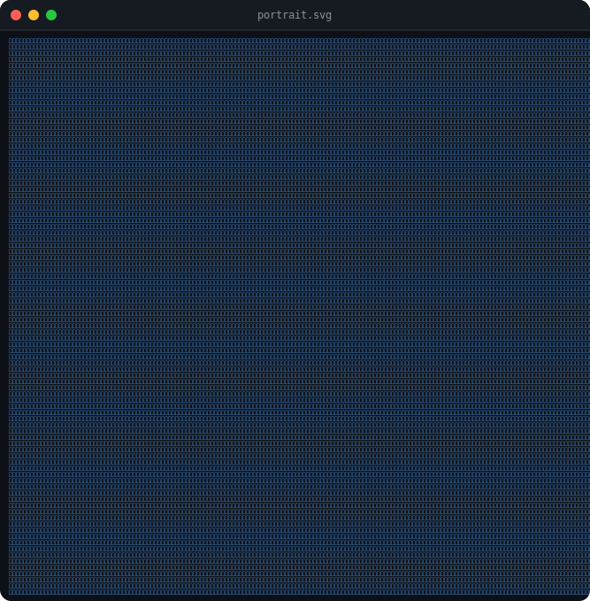
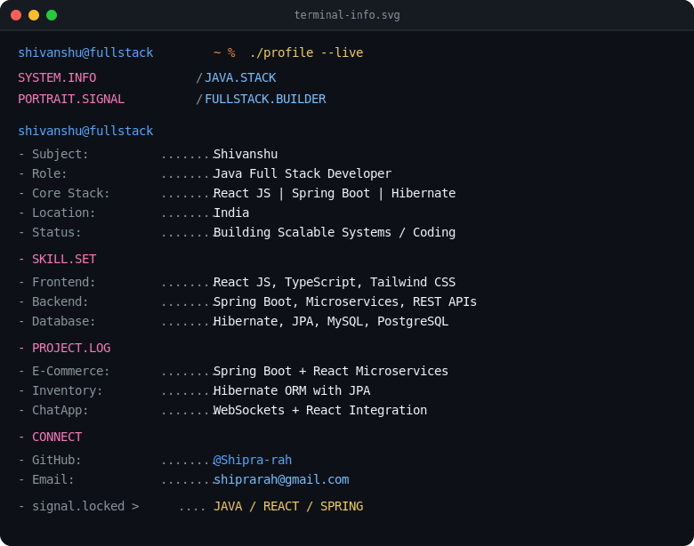

<table width="100%" padding-y="5px">
  <tr>
    <td width="50%" align="center">
      
    </td>
    <td width="50%" align="center">
      
    </td>
  </tr>
</table>

 

## 🧑‍💻 About Me

Hi, I'm **Shivanshu** — a **Java Full Stack Developer** building scalable web systems with **React JS, Spring Boot, and Hibernate**.

- 🔭 I'm currently working on **microservices-based full stack applications**
- 🛠️ **Frontend:** React JS, TypeScript, Tailwind CSS
- ⚙️ **Backend:** Spring Boot, Microservices, REST APIs
- 🗄️ **Database:** Hibernate, JPA, MySQL, PostgreSQL
- 🚀 **Projects:** E-Commerce platform (Spring Boot + React), Inventory system (Hibernate ORM), Real-time ChatApp (WebSockets + React)
- 📫 **Reach me:** [@Shipra-rah](https://github.com/Shipra-rah) · shiprarah@gmail.com
